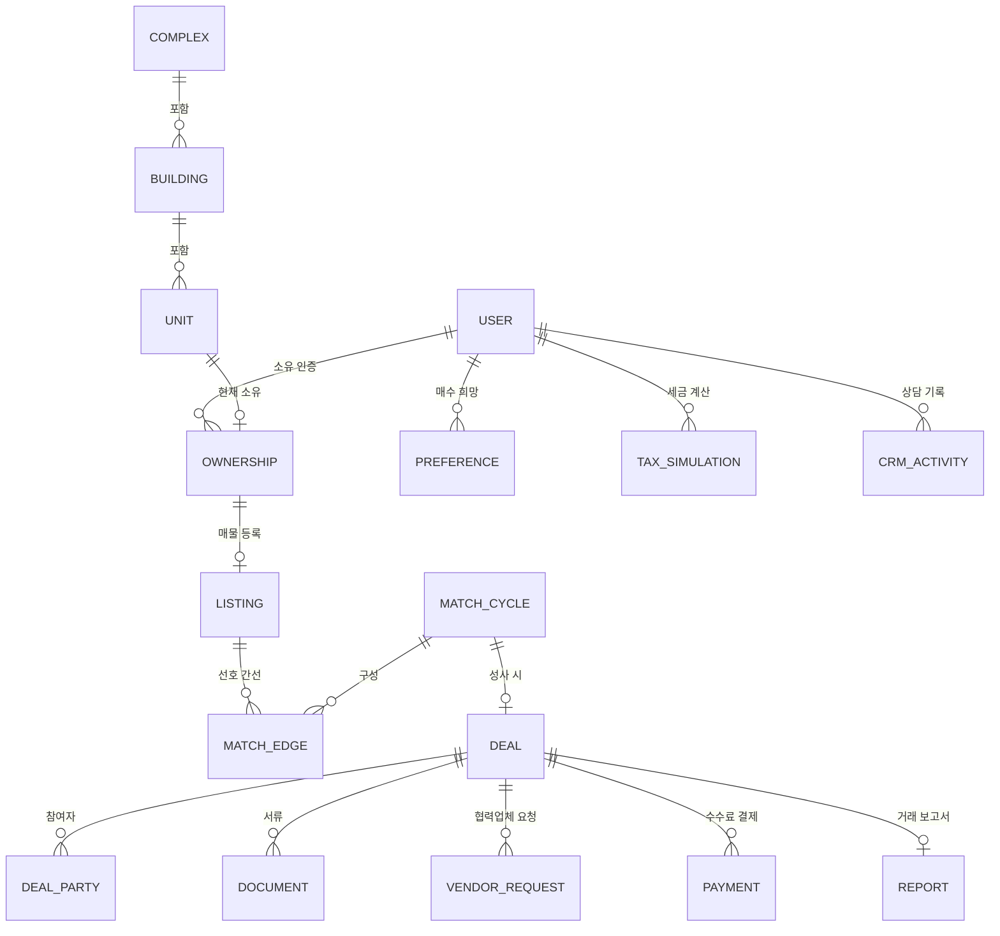

# 04. 데이터 모델 (초안 ERD)

## 1. 핵심 엔티티 관계



## 2. 테이블 정의 (주요 컬럼)

### 회원·인증

```sql
-- 회원
users (
  id, phone, name, birth_date,        -- 본인인증 결과
  kakao_id, status,                    -- pending | verified | suspended
  membership_tier,                     -- free | premium
  created_at
)

-- 소유권 인증
ownerships (
  id, user_id, unit_id,
  verify_method,                       -- iros_api | kakao_cert | manual
  verify_status,                       -- pending | verified | expired | revoked
  verified_at, reverified_at,          -- 매칭 직전 재검증 시각
  co_owner_consent BOOLEAN
)
```

### 단지·물건

```sql
complexes ( id, name, address, total_units, is_active )       -- 서비스 오픈 단지
buildings ( id, complex_id, dong_no, floors, elevator )
units (
  id, building_id, ho_no, floor,
  unit_type,                           -- 84A, 59B 등 타입코드
  area_exclusive, direction            -- 전용면적, 향
)
```

### 매물·선호

```sql
-- 매물 (매도측 프로필)
listings (
  id, ownership_id,
  ask_price, price_flex,               -- 희망가, 협상 폭
  move_window_start, move_window_end,  -- 이사 가능 기간
  interior_grade,                      -- full | partial | basic | needs_repair
  interior_year, is_extended,
  occupancy,                           -- owner | jeonse | wolse | vacant
  tenant_lease_end,
  disclosure JSONB,                    -- 고지사항 체크리스트
  status                               -- draft | active | matched | closed
)

listing_photos ( id, listing_id, url, is_blurred, sort_order )

-- 매수 희망 (매수측 프로필)
preferences (
  id, user_id,
  target_complexes INT[], target_dongs INT[],
  floor_min, floor_max,
  unit_types TEXT[], directions TEXT[],
  budget_max, loan_plan,
  weights JSONB                        -- {location: 0.3, condition: 0.25, ...}
)
```

### 매칭

```sql
-- 배치 실행 스냅샷
match_runs ( id, run_at, algorithm_version, input_snapshot_ref, stats JSONB )

-- 선호 간선 (배치별 생성)
match_edges (
  id, run_id, from_listing_id, to_listing_id,
  weight NUMERIC, score_detail JSONB   -- 항목별 점수 분해 (설명가능성)
)

-- 탐색된 사이클
match_cycles (
  id, run_id,
  cycle_length, cycle_score,
  member_listing_ids INT[],            -- 순서 보존 (A→B→C→A)
  status,                              -- proposed | accepted | rejected | expired
  proposed_at, respond_by              -- 48시간 수락 기한
)

cycle_responses ( id, cycle_id, user_id, response, responded_at )
```

### 거래·서류·협력업체

```sql
-- 딜 (사이클 1개 = 딜 1개, 계약 N건 포함)
deals (
  id, cycle_id,
  stage,                               -- 상태머신: negotiating | pre_contract | contracted
                                       --   | interim | closing | moved | done | cancelled
  contract_date, closing_date, move_date
)

deal_parties (
  id, deal_id, user_id,
  sell_listing_id, buy_listing_id,
  net_settlement NUMERIC               -- 매수가 - 매도가 (차액 정산)
)

documents (
  id, deal_id, party_id, doc_type,     -- registry | resident | tax_cert ...
  source,                              -- kakao_wallet | upload | iros
  file_ref, issued_at, expires_at,
  purge_at                             -- 거래 종료 후 파기 예정일
)

vendor_requests (
  id, deal_id, vendor_type,            -- mover | legal | interior | cleaning
  payload JSONB,                       -- 전달 조건 (이사일, 잔금일 등)
  status                               -- sent | quoted | selected | done
)
vendor_quotes ( id, request_id, vendor_id, amount, detail, status )
vendors ( id, type, name, contact, contract_terms, rating )
```

### 결제·세금·CRM·보고서

```sql
payments (
  id, deal_id NULLABLE, user_id, kind, -- match_fee | membership | vendor_settlement
  amount, pg_provider, pg_tid,
  status,                              -- authorized | captured | refunded
  receipt_type, receipt_issued_at      -- cash_receipt | tax_invoice
)

tax_rules (                            -- 세율표 버전 관리
  id, tax_type, effective_from, effective_to, rule JSONB
)
tax_simulations ( id, user_id, deal_id NULLABLE, input JSONB, result JSONB, created_at )

crm_activities (
  id, user_id, deal_id NULLABLE, agent_id,
  channel,                             -- kakao | phone | visit
  note, next_action_at
)

reports ( id, deal_id, pdf_ref, generated_at )
```

## 3. 설계 원칙

1. **매칭 재현성**: `match_runs` 스냅샷으로 "그때 왜 이 매칭이 나왔는지" 항상 재구성 가능
2. **점수 설명가능성**: `match_edges.score_detail`에 항목별 분해 저장 → 회원에게 "왜 이 매칭인지" 표시
3. **개인정보 수명주기**: `documents.purge_at` 기반 자동 파기 배치 (개보법 대응)
4. **사이클 = 단일 딜**: 계약 N건을 딜 1개로 묶어야 CRM·일정·보고서가 순환거래 단위로 동작
5. **세율 버전 관리**: 세법 개정 시 `tax_rules`에 새 버전 추가, 시행일로 조회 — 코드 배포 불필요
