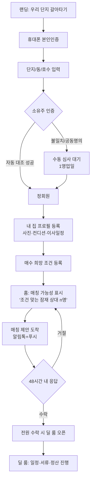

# 07. 프론트엔드 기획서 (MVP)

모바일 웹 우선(Mobile-first). 데이팅 앱의 문법(프로필 카드, 매칭 알림, 수락/거절)을 부동산에 이식한다.

## 1. 정보구조 (IA)

```
/                          랜딩 (비로그인)
/onboarding                가입 플로우 (본인인증 → 단지선택 → 소유주인증)
/home                      홈 = 매칭 대시보드 (로그인 후 기본 화면)
/profile
  /my-home                 내 집 프로필 (매도측 정보)
  /wishlist                매수 희망 조건 (이상형 설정)
/matches
  /[cycleId]               매칭 제안 상세 (사이클 뷰 + 수락/거절)
/deal/[dealId]             딜 룸 (매칭 성사 후 거래 진행)
/calculator                세금 계산기 (비로그인도 접근 가능 — 유입 채널)
/notifications             알림함
/settings                  계정·알림 설정
```

**바텀 탭 (5개):** 홈 · 매칭 · (＋프로필 등록) · 계산기 · 마이

## 2. 핵심 사용자 흐름



## 3. 화면별 정의

### 3-1. 랜딩 `/`

목적: 사전등록 전환. 비로그인 상태의 유일한 마케팅 접점.

```
┌─────────────────────────┐
│  ○○단지 갈아타기,        │
│  기다리지 말고 맞바꾸세요   │
│                         │
│  [지금 우리 단지에서]     │
│  │ 84→109 대기 12명 │    ← 실시간 수요 카운터 (핵심 후킹)
│  │ 59→84 대기 8명  │    │
│                         │
│  [내 매칭 가능성 확인하기]  ← CTA → 온보딩
│                         │
│  순환거래가 뭔가요? (3컷 설명)│
│  세금 계산기 무료 체험 →    │
└─────────────────────────┘
```

- 단지별 랜딩 URL 분리 (`/c/[complexSlug]`) — 전단지 QR·단지 커뮤니티 유입 추적
- 수요 카운터는 실데이터 부족 시 사전등록 수 기반으로 표기 (허위 금지)

### 3-2. 온보딩 `/onboarding` (4단계 스텝퍼)

| 스텝 | 화면 | 주요 상태 |
|---|---|---|
| 1 | 휴대폰 본인인증 (표준창 호출) | 성공/실패/중복가입 감지(CI) |
| 2 | 단지 선택 → 동·호수 셀렉터 | 서비스 미오픈 단지 → 오픈 알림 신청 전환 |
| 3 | 소유주 인증: "등기부를 자동 확인합니다" 로딩(수 초~수십 초) | 성공 / 불일치 / 공동명의 → 수동심사 안내 |
| 4 | 완료 + 다음 행동 유도 "프로필을 등록하면 매칭이 시작돼요" | |

- 스텝 이탈 대비: 각 스텝 완료 시점 저장, 재진입 시 이어하기
- 수동 심사 상태는 홈 상단 배너로 노출 ("심사 중 · 예상 1영업일")

### 3-3. 내 집 프로필 `/profile/my-home`

데이팅 앱의 "내 프로필 작성"에 해당. **완성률 게이지**가 핵심 UX.

- 섹션: 사진(최소 5장, 블러 옵션) → 희망가 → 이사 가능 기간(캘린더 범위) → 인테리어(등급 선택 + 시공연도) → 점유 상태 → 고지사항 체크리스트
- 완성률 80% 미만이면 매칭 풀에 미진입 — 게이지와 "매칭 시작까지 2항목 남음" 카피로 완성 유도
- 사진 업로드: 촬영 가이드 오버레이 (거실→주방→안방→욕실→뷰 순서 제안)

### 3-4. 매수 희망 조건 `/profile/wishlist`

"이상형 설정" 화면.

- 동 선택(단지 배치도 미니맵에서 탭), 층 범위 슬라이더, 타입 칩(84A·84B·109A…), 향 칩, 예산 상한
- **가중치 설정**: "무엇이 더 중요하세요?" — 위치/컨디션/가격/일정 4항목 드래그 순위 (알고리즘 가중치로 직결)
- 저장 시 즉시 피드백: "이 조건과 맞는 잠재 상대 n명" (실명·호수 비공개)

### 3-5. 홈 `/home` — 매칭 대시보드

로그인 후 기본 화면. 상태별로 완전히 다른 뷰를 보여준다.

| 내 상태 | 홈 콘텐츠 |
|---|---|
| 프로필 미완성 | 완성률 게이지 + 남은 항목 CTA |
| 매칭 대기 | "잠재 상대 n명" + 대기 순번 느낌의 진행 애니메이션 + 조건 완화 제안 ("층 범위를 넓히면 +3명") |
| 제안 도착 | **매칭 카드** (아래 3-6) 최상단 고정 + 카운트다운 |
| 거래 진행 중 | 딜 룸 바로가기 + 다음 할 일 1개 |

- "조건 완화 제안"은 매칭 엔진의 간선 시뮬레이션 결과 — 유동성 부족을 UX로 푸는 핵심 장치

### 3-6. 매칭 제안 상세 `/matches/[cycleId]` — 서비스의 하이라이트

```
┌─────────────────────────┐
│ ⏱ 응답까지 47:12:09      │  ← 48h 카운트다운 (긴장감)
│                         │
│      [사이클 다이어그램]    │
│    나 ──▶ 103동 고층      │  ← 원형 그래프. 내가 받는 집 강조,
│    ▲            │       │     타인 정보는 동·층·타입만 (호수 비공개)
│    └── 105동 중층 ◀┘      │
│                         │
│ 내가 가게 될 집            │
│ ┌─────────────────────┐ │
│ │ 사진 캐러셀(블러해제)     │ │
│ │ 84A · 고층 · 남향       │ │
│ │ 올수리('24) · 확장       │ │
│ │ 매칭 점수 92 ⓘ         │ │  ← ⓘ탭: 점수 분해 (내 가중치 기준)
│ └─────────────────────┘ │
│                         │
│ 예상 정산                 │
│  내 매도가   9.5억         │
│  매수가    11.2억         │
│  차액      +1.7억 ⓘ      │
│  예상 취득세  ~3,700만     │  ← 세금 계산기 연동 프리필
│                         │
│ 이사 가능 교집합: 10.15~11.30│
│                         │
│ [ 거절 ]   [ 수락하기 ]    │
└─────────────────────────┘
```

- **수락 현황은 비공개** ("2/3 수락" 노출 금지 — 마지막 1인에게 압박·거절 책임 전가 방지). "전원 수락 시 알려드려요"만 표기
- 거절 시 사유 선택(가격/컨디션/일정/기타) → 알고리즘 개선 데이터
- 수락 = 가계약 의사 표시임을 명확 고지 (법적 구속력 없음 단계 명시)

### 3-7. 딜 룸 `/deal/[dealId]`

전원 수락 후 열리는 거래 진행 공간. MVP에서는 **읽기 중심 + 운영자 채널**.

- 타임라인: 가계약 → 본계약 → 잔금·등기 → 이사 (현재 단계 하이라이트, 각 단계 D-day)
- 참여자 카드: 이제 실명·연락처 공개 (전원 동의 후)
- 다음 할 일 위젯: "10/2까지 인감증명서 준비" 체크리스트 (MVP는 운영자가 수동 등록)
- 문의: 카카오 채널 딥링크 (MVP는 채팅 자체 구현 안 함)

### 3-8. 세금 계산기 `/calculator`

- 비로그인 접근 가능 — SEO·커뮤니티 공유용 유입 채널
- 탭 3개: 양도세 / 취득세 / 보유세 + "갈아타기 통합" 탭
- 입력 폼 → 결과 카드(총 비용 강조) → "우리 단지에서 갈아탈 사람 찾기" CTA로 가입 전환
- 로그인 상태면 내 물건 정보 자동 프리필

### 3-9. 알림함 · 마이

- 알림함: 매칭 제안(최상단 고정), 심사 결과, 딜 단계 변경. 읽음 처리, 딥링크
- 마이: 인증 상태 뱃지, 프로필 바로가기, 매칭 이력, 계정 설정(알림 수신, 탈퇴)

## 4. 컴포넌트 설계 (핵심 공통)

| 컴포넌트 | 용도 | 비고 |
|---|---|---|
| `CycleDiagram` | 사이클 원형 시각화 | SVG, 2~4인 대응, 애니메이션(화살표 흐름) |
| `MatchCard` | 매칭 제안 요약 카드 | 홈/알림 재사용 |
| `HomeProfileCard` | 집 프로필 (사진+스펙) | 블러 상태 prop |
| `CountdownTimer` | 48h 카운트다운 | 서버시간 기준 |
| `CompletenessGauge` | 프로필 완성률 | |
| `StepFlow` | 온보딩/등록 스텝퍼 | 이어하기 지원 |
| `MoneyBreakdown` | 정산/세금 분해 표 | 계산기와 공유 |
| `DongSelector` | 단지 배치도 미니맵 | 단지별 SVG 데이터 |

## 5. 기술 구성

- **Next.js(App Router) + TypeScript + Tailwind** — 모바일 웹 우선, 추후 웹뷰 앱 포장
- 상태: TanStack Query(서버 상태) + Zustand(폼 진행 상태) / 폼: react-hook-form + zod
- 사이클 다이어그램: 순수 SVG 컴포넌트 (라이브러리 불필요, 2~4 노드 고정 레이아웃)
- 인증: 본인인증 표준창 연동 페이지는 별도 라우트(리다이렉트 방식), 결과는 서버 콜백
- 접근성/신뢰: 금액 표기 콤마·억 단위 병기, 모든 추정치에 ⓘ 근거 표시 — **부동산은 신뢰가 UI**

## 6. MVP 화면 우선순위 (개발 순서)

| 순위 | 화면 | 이유 |
|---|---|---|
| P0 | 랜딩 + 온보딩 + 프로필 2종 | 유동성(회원 풀) 확보가 최우선 |
| P0 | 홈(상태별) + 매칭 제안 상세 | 핵심 가치 전달 |
| P1 | 알림함, 마이, 딜 룸(읽기) | 성사 후 운영 지원 |
| P2 | 세금 계산기 | 유입 채널 — 매칭 검증 후 |

P0만으로 "가입 → 프로필 → 제안 → 수락"의 풀 루프가 돌아간다. 관리자 백오피스(수동 심사, 매칭 발송, 딜 관리)는 별도 문서로 분리 예정.
